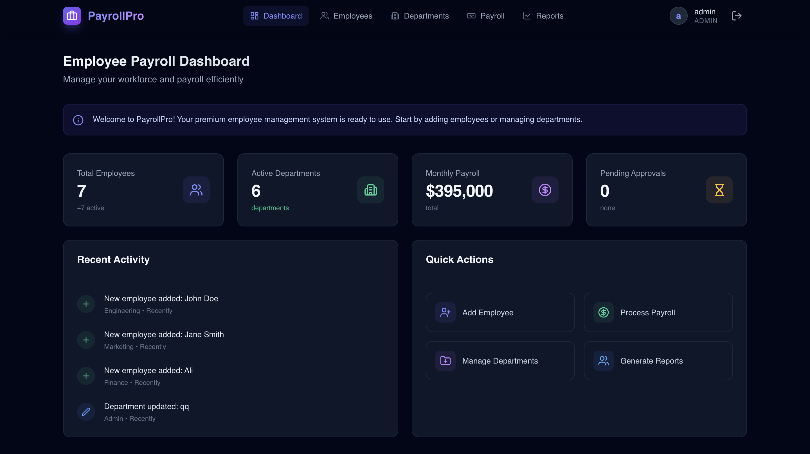

# PayrollPro - Modern Employee Payroll Management System


## 📋 Problem Statement
In many organizations, legacy payroll and employee management systems are often manual, error-prone, and lack real-time visibility. This results in administrative overhead, fragmented data, and a poor user experience. **PayrollPro** solves this by providing a unified, high-performance platform that automates personnel registry, payroll processing, and workforce analytics with a state-of-the-art glassmorphic design.

## 🛠 Tools Used
- **Frontend**: React 19, Tailwind CSS, Lucide React, Vite.
- **Backend**: Node.js (Express), JWT Authentication.
- **Database**: MySQL (mysql2).
- **Styling**: Glassmorphism (Backdrop-blur, Slate-950, Indigo/Purple Gradients).
- **Deployment**: Docker Compose.

## ⚙️ Installation Steps
1. **Clone the Project**:
   ```bash
   git clone <repository-url>
   cd employee-payroll-react
   ```
2. **Setup Server Configuration**:
   - Navigate to the `server` directory.
   - Configure your MySQL credentials in `config.env`.
3. **Install Dependencies**:
   ```bash
   npm install
   cd server && npm install
   ```

## 🚀 Execution Procedure
### Option 1: Development Mode (Direct)
1. **Start Backend**:
   ```bash
   cd server
   npm run migrate && npm run dev
   ```
2. **Start Frontend**:
   ```bash
   # In a new terminal (root directory)
   npm run dev
   ```
3. **Access App**: Open `http://localhost:5173`. Use credentials: `admin@company.com` / `admin123`.

### Option 2: Docker Mode
```bash
docker-compose up --build
```

## 📸 Output Screenshots (Premium UI)



## 🎯 Conclusion
PayrollPro successfully transforms a standard college project into a high-end, production-grade payroll management system. By integrating modern web technologies (React 19, Tailwind) with a robust Node.js/MySQL backend, it offers a scalable solution for organizations to manage their most important asset—their people.
